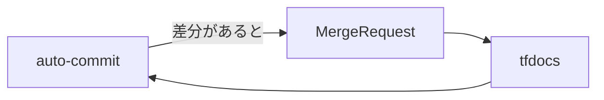

# きっかけ

terraform-docsを使ってmoduleレジストリのドキュメント化を行っていた。

https://terraform-docs.io/

moduleを修正するたびに、手動で`terraform-docs`を実行するわけなのだが、よく忘れる。  
なので自動でドキュメント生成してコミットまで追加してくれる方法を考えた。

# 前提知識

* Gitlabを使用したことがある
* .gitlab-ci.ymlを使ってpipelineを構築したことがある

# 実装方法

結論はAccess Tokenを使ったやり方。


## ちなみにGitHubの場合

`GitHub Actions`だと簡単にコミットに追加できるよう準備されているのでこっちを使った方が良い。

https://terraform-docs.io/how-to/github-action/

今回はGitlabなので除外。

## SSH Keyを使ったやり方

よく見かける方法がこれ。  
でも鍵管理したくないので除外。

https://qiita.com/ynott/items/8cb3b3995cb41ca78437

https://qiita.com/JunkiHiroi/items/02af97559a5b5ca2af21

## Access Tokenを使ったやり方

こっちが一番シンプルだった。

### Access Tokenの払い出し

選択肢が複数ある。

* Personal Access Token
* Group Access Token
* Project Access Token

`Personal Access Token`は個人アカウントに紐づくため、アカウントを削除しちゃうと動かなくなる。

https://docs.gitlab.com/ee/user/profile/personal_access_tokens.html

`Project Access Token`で最小権限でも良いが、moduleレジストリが増えるたびにtoken発行するのは面倒だ。

https://docs.gitlab.com/ee/user/project/settings/project_access_tokens.html

`Group Access Token`でmodulesグループ配下で汎用的に使えるようにしておいた方が良さそう。

https://docs.gitlab.com/ee/user/group/settings/group_access_tokens.html

#### 払い出し方

グループ >> 設定 >> アクセストークン 

roleはDeveloper、scopeはwrite_repositoryを追加して作成する。


#### 変数登録

tokenが発行されるので対象グループのCI/CDに変数を登録する。

グループ >> 設定 >> CICD >> 変数

Mask variableだけチェック入れておく。


#### CIの修正

moduleレジストリのciを次のように追記する。  

```yaml:.gitlab-ci.yml

tfdocs:
  stage: build
  image: 
    name: quay.io/terraform-docs/terraform-docs
    entrypoint:
      - ''
  script:
    - terraform-docs markdown table .
  artifacts:
    paths:
      - README.md
  rules:
    - if: $CI_PIPELINE_SOURCE == "merge_request_event"

auto-commit:
  stage: deploy
  image:
    name: alpine/git
    entrypoint:
      - ''
  before_script:
    - git config --global user.name "$GITLAB_USER_NAME"
    - git config --global user.email "$GITLAB_USER_EMAIL"
  script:
    - if [ -n "$(git status --porcelain)" ]; then # 変更差分チェック
    - git add README.md
    - git commit -m "[ci skip] Terraform-docs Updating README.md"
    - git push -f https://oauth2:$COMMIT_ACCESS_TOKEN@$CI_SERVER_HOST/$CI_PROJECT_PATH.git HEAD:$CI_COMMIT_REF_NAME
    - echo "Commit successful"
    - fi
  needs:
    - tfdocs
  rules:
    - if: $CI_PIPELINE_SOURCE == "merge_request_event"

```

生成した`README.md`ファイルは`artifacts`で、次の`auto-commit`ジョブに引き継いでる。

##### before_scriptでユーザー情報を定義

`$GITLAB_USER_NAME`と`$GITLAB_USER_EMAIL`は予約変数で、pipelineを実行したユーザー情報が入る。  
つまり`tfdocsジョブ`で生成したREADME.mdのコミッターは自分になる。 

```yaml:.gitlab-ci.yml
  before_script:
    - git config --global user.name "$GITLAB_USER_NAME"
    - git config --global user.email "$GITLAB_USER_EMAIL"
```

https://docs.gitlab.com/ee/ci/variables/predefined_variables.html

##### commitのコメントで無限ループ回避

`[ci skip]`を先頭につけるだけで、CIの実行をスキップできる。  
これがないと常に変更差分がある場合、無限にCIが動いてしまうので必須である。  



```yaml:.gitlab-ci.yml
    - git commit -m "[ci skip] Terraform-docs Updating README.md"
```

https://docs.gitlab.com/ee/user/project/push_options.html

本当は-oでci.skipを指定するのだが、コミット履歴から見分けが付きづらいので辞めた。

##### push時にToken指定してアクセスする

払い出したAccess Tokenをここで使用する。
oauth2に沿ったURLに修正する必要がある。

https://docs.gitlab.com/ee/api/oauth2.html#access-git-over-https-with-access-token

```
https://oauth2:<your_access_token>@gitlab.example.com/project_path/project_name.git
```

変数を使えば、どのプロジェクトでも汎用的に利用できるようになるのでオススメ。

```yaml:.gitlab-ci.yml
    - git push -f https://oauth2:$COMMIT_ACCESS_TOKEN@$CI_SERVER_HOST/$CI_PROJECT_PATH.git HEAD:$CI_COMMIT_REF_NAME
```

# まとめ
Access Tokenを使って簡単にauto-commitができるようになった。  
Access Tokenを使えば、プライベートリポジトリからpullしてCIを回すこともできるのでオススメ。
