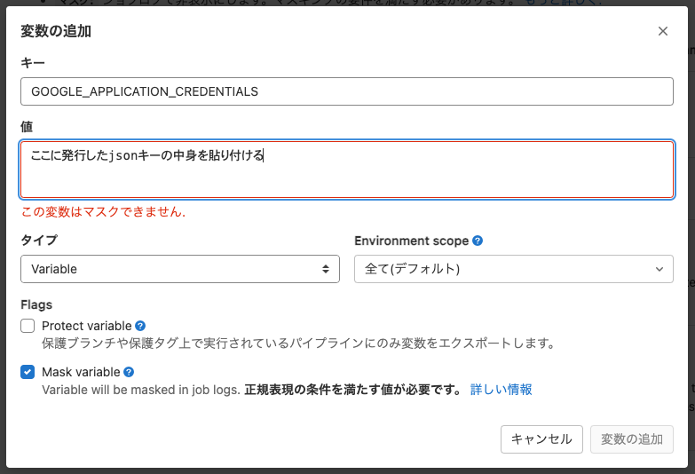

GCPを管理しているterraformをキーレスで運用したいと思ったとき、GKEとWorkload Identity(WI)がすごく相性が良かったので共有。

# 前提

ここでは次の技術を使った事例の紹介になる。

* Gitlabでterraformのコード管理を行う
* GCPをterraformでコード管理する
* GKEでWIを使って、サービスアカウント(SA)のjsonキーを利用しないようにする

# 基本的なterraformの利用方法

## GCPをterraformで管理する場合

ローカルでterraformを扱う場合は、ADCを利用することになるでしょう。

```sh
gcloud auth application-default login
```

https://registry.terraform.io/providers/hashicorp/google/latest/docs/guides/getting_started

基本的にはチームでterraform管理することが大半なため、ここではGitlab Runnerを使ってチーム内でレビューし合いながらapplyすることになります。

## CIの準備（jsonキーを使った場合）

1. GCPでSAを作成する
1. 作成したSAからjsonキーを発行する
1. GitlabのCI/CD変数に払い出したjsonキーの値を設定する

設定 >> CI/CD >> 変数



CIのためにSAのjsonキーを払い出したが、このリポジトリで意図しない設定などでjsonキーが流出する可能性がある。  
terraformは仕組み上、GCPのオーナー権限を持つことが多いため流出するとリソース使われまくってマイニングされまくることも考えられる。

# キーレス運用

